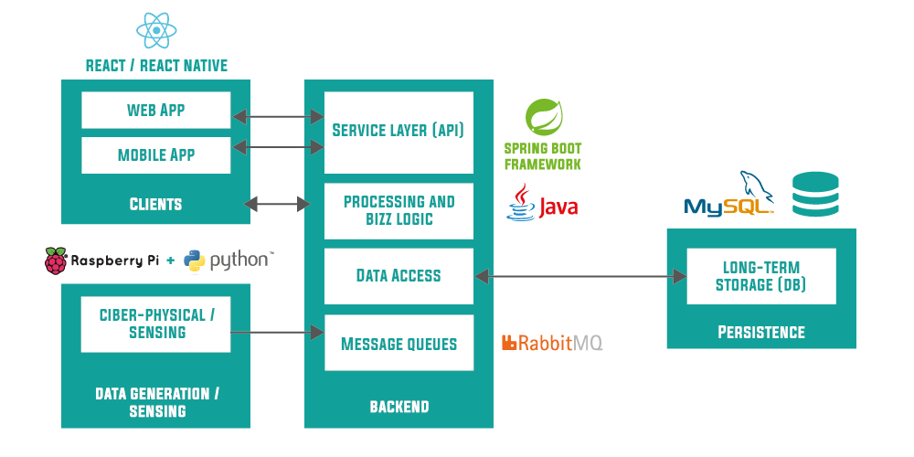
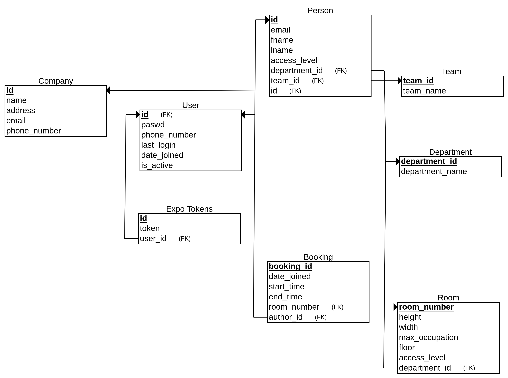

# Intrusion Tracker

## Idea

This project is a product of a practical assignement of one of our classes: [Introduction to Software Engineering](https://www.ua.pt/en/uc/12288) and the main idea behind it is to implement a system capable of logging all accesses to a company building and capable of performing the right action when confronted with a strange access.
  
## Main roles (Contributors)

* **Product Owner:** [Diogo Silva](https://github.com/HerouFenix)
* **Team Manager:** [Vasco Ramos](https://github.com/vascoalramos)
* **Architect:** [Tiago Mendes](https://github.com/tiagocmendes)
* **DevOps Master:** [João Vasconcelos](https://github.com/jmnmv12)

## Backlog Management

We will be using Scrum Agile Methods and will be using Jira Software to manage Scrum Sprints and the Backlog.

Jira Project: [Jira - Intrusion Tracker](https://intrusiontracker.atlassian.net/)

## Git Platform

The chosen Git platform is [GitLab](https://about.gitlab.com/) and all the version control.

### Git Standards
* For each new feature create a new branch.
* For each fix create a new branch
* Never merge directly, always make pull requests and identify at least one person to check (review) that pull request before merging the PR.

#### New feature branch
* For each new feature create a branch following the standard: `feature/<feature_name>`.

#### New Issue branch
* For each fix create a branch following the standard: `hotfix/<fix-name>`.

## Access Server
* Our machine: `deti-engsoft-11.ua.pt`
* Group number: `32`
* **Access command:** `ssh <user>@deti-engsoft-11.ua.pt`

## How to run
* Access the url `http://192.168.160.220:3000/` to access our app.
* To access our API documentation access the url `http://192.168.160.220:8080/api/v1/swagger-ui.html` .
* To access our mobile App you just need to install the apk, [Intrusion Tracker - APP](https://gitlab.com/intrusion-tracker/intrusion-tracker/raw/master/Intrusion-Tracker.apk), available in the root folder of this repository.

## Accesses

| Username  | Password | Role |
| ------------- | ------------- | -------- |
| j.vasconcelos99@ua.pt  | pwd  | ADMIN |
| diogo04@ua.pt  | pwd  | SECURITY ENFORCER |
| tiagocmendes@ua.pt  | pwd  | TEAM LEADER |

## Use cases and User Stories

### Users
* Security Team
* Administration
* Team Manager

| Use case | User stories |
|--|--|
| **Monitor entries and exits**| **Administration and security teams can monitor the accesses**  The administration and security teams want to have access to the entry and exit logs, so they can dectect strange activities|
| **Generate automatic reports**| **Administration and security teams can generate activity reports** The administration and security teams want to generate a report about all the company activity in the last 24 hours. The administration and security teams want to generate a report about all the company activity in May.|
| **Manage accesses**| **Administration and security teams can revoke accesses** The administration and security teams can revoke the employees and visitors accesses to specific rooms, floors or areas through their access level.|
| **Alert strange accesses**| **Administration and security teams can be alerted to strange accesses** The administration and security teams want to be notified by email,push notification, sms and call when there are strange accesses so they can verify those activities..|
| **Visualize graphics/data analysis (access hotmap,histogram,..)**| **Administration,security teams and team managers can visualize many graphics about diversified information** The administration,security teams and Team Manager want to view a heatmap to visualize wich room has more accesses in the last week Histogram - Accesses by hour/day day/month Hotmap - Room accesses Histogram - Suspect activities by month/day/... Histogram - Number of revoked accesses   Board with suspect employees   History of all the employees that accessed a room.|
| **Manage individual rooms**| **Administration and security teams can visualize accesses**  The Administration and security teams want to visualize accesses by rooms and detect suspect activities.  **Administration,security teams and team manager can book a specific room in a specific time** The administration,security teams and team managers can book a specific room in a specific time, revoking access to any person that won't be joining the meeting..|
| **Manage individual employees**| **Administration,security teams and team manager can visualize suspect accesses** The administration,security teams and team managers want to visualize suspect accesses so they can analyse the individual history.|
| **Create a plant by floor**| **Drag and drop to create a plant to each floor of the company** Create plants of the company so they can visualize more clearly any pushed alerts.|

**Notes**:
* If a employee has revoked access to a specific room and tries to access it more than 3 times, an alert is sent (to the CEO and to the employee, so he can verify the alert).
* We are going to use a "Suspect algorithm" to identify suspect employees.

## Architecture

### Architecture Diagram

### Clients

#### Web App
For the **Web App** we are going to use [**ReactJS**](https://reactjs.org/), a JavaScript library for building user interfaces. The main benefits of using **ReactJS** is due to it's vast library of templates and pre-fabricated elements, ease of use and ability to create reactive and graphical elements on-the-go.  

**It also offers:**    
* A single component  
* A stateful component  
* An application  
* A component using external plugins  

#### Mobile App
For the **Mobile App** we are going to use [**React Native**](https://facebook.github.io/react-native/) because we wanted to guarantee there is portability between our **Web App** and our mobile application. The main benefits of using **React Native** are the same as described above for **ReactJS** and also the ability of creating native apps for **Android** and **iOS**.

### Ciber-physical / sensing
* We are going to simulate all the data.
* We are going to have a **Raspberry3** running all our scripts that will feed our application with a constant data streams.

### Backend

#### Message queues

For the messages queues we are going to use [**RabbitMQ**](https://www.rabbitmq.com/), one of the most popular open source message brokers. It offers several benefits, some of them being:  

* Asynchronous Messaging
* Developer Experience
* Distributed Deployment
* Enterprise & Cloud Ready
* Tools & Plugins
* Management & Monitoring

#### Service layer (API) + Processing & Bizz Logic

For the backend of the Web app we are going to be using **Spring** because we wanted to use a new technology and it's the recommend backend technology by the teacher.
Besides that Spring features:

- Convenient Annotations
- IoC Container's implementation of Dependency Injection
- Ease of integration with frontend frameworks (i.e React)

#### Data Access
* For the Data access layer we are going to use **Java Persistence API**.

### Long-Term Storage
* We are going to use **MySQL**.
* Initially, we were thinking of using MongoDB.
* Due to the fact that there are many relations we want to define between our entities and that, as we were thinking about the document's structures, we realized they'd turn out too big with too many nested documents we ultimately decided to end up using MySQL.

## License
This project is licensed under the MIT License - see the [LICENSE](LICENSE) file for details.
